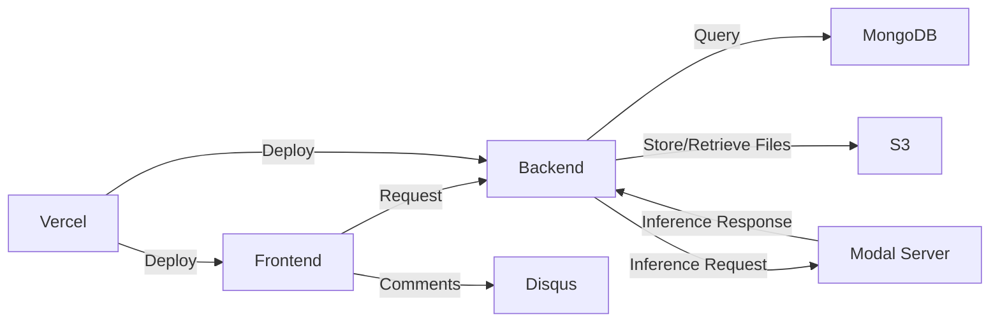
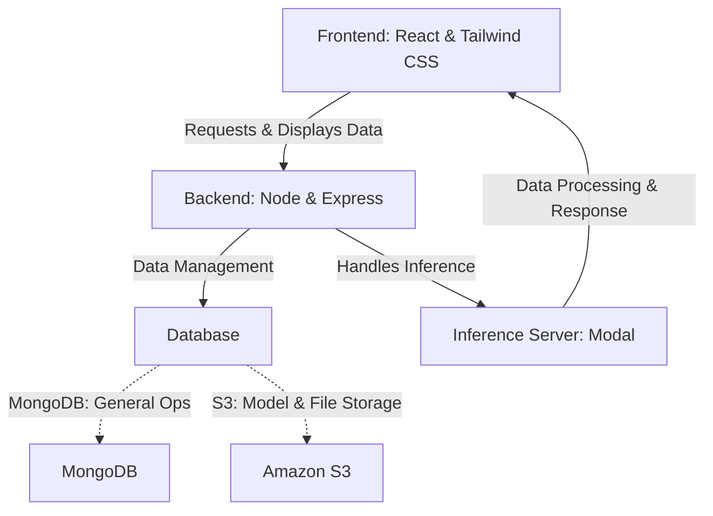

# How it Works

# Frontend

The frontend of the application is built using [React](https://reactjs.org/), a popular JavaScript library for building user interfaces. For styling, we use [Tailwind CSS](https://tailwindcss.com/), a utility-first CSS framework for rapidly building custom designs.

# Backend

The backend is built with [Node.js](https://nodejs.org/en/) and [Express.js](https://expressjs.com/), a minimal and flexible Node.js web application framework.

# **Database**

We use MongoDB for general operations and Amazon S3 for storing model files, input files, and output files.

# **Inference Server**

The inference server is a separate backend server deployed on [Modal](https://modal.com/). It receives input and model files from the database and returns the response to the frontend.

# **Social Interactions**

We use [Disqus](https://disqus.com/) for social interactions. Each model has its own comment section based on the model token id.

# **Deployment**

The frontend and backend are both deployed on [Vercel](https://vercel.com/), a platform for static sites and Serverless Functions.

# Overview

# System Design

